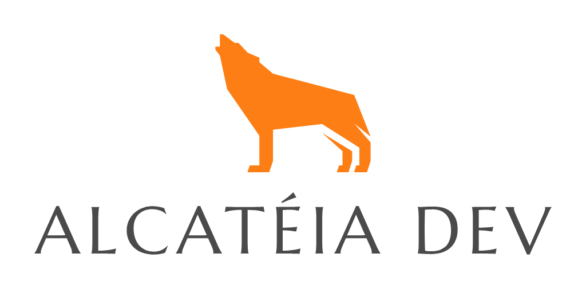

# Curso na Udemy: Microservices e Login: Spring Boot, Spring Security e OAuth2

Quase todas as aplicações SaaS tem controle de usuários. Mas implementar não é simples. Existem algumas formas diferentes, umas mais fáceis outras mais complexas.

Neste curso vamos abordar, de uma forma fácil, o controle de usuários, vamos implementar um login com o Spring Security, que é muito simples. Vamos usar o Spring Session, para recuperar os usuários em vários microservices e vamos explorar o Keycloak para testar o padrão OAuth2.

Tudo de forma simples e prática. E mais. Vamos criar os códigos fonte junto com vocês. Linha por Linha.

** Conceitos do curso:

1. Autorização e Autenticação - Spring Security;

2. OAuth2;

3. Sessão de usuário em microservices - Spring Session;

4. Roteamento com Gateway API e Login- Zuul;

5. Login;


## Alcateia Dev



Link com todos os cursos e cupons: [http://www.alcateiadev.com.br/](http://www.alcateiadev.com.br/) <br>
Slack: https://alcateiadev.slack.com/

## Comandos
```
docker-compose -f XXX up
create database micro_login

./add-user-keycloak.sh -u marcelo
./standalone.sh
http://localhost:8080/auth/admin/
```